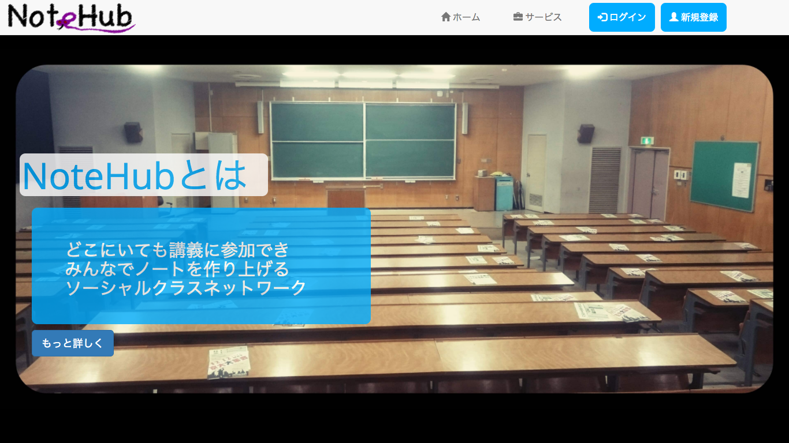

# NoteHub

Facilitation System for lectures at University

## Description

This application facilitates conversation and cooperation between attendees for lectures at university. Watching lecture video on Live Streaming Screen, Have a conversation with your classmates, Co-Edit notes with your classmates.

## Features

- Live Streaming for lectures at university
- Chat system
- Note Co-Editing

## Requirement

- PHP 5.6.30
- Laravel 5.3.26

## Installation and How tu run a local server

    git clone https://github.com/MasayaHayashi724/notehub.git
    cd notehub
    php artisan serve

Then, visit http://localhost:8000

## Author

- [MasayaHayashi724](https://github.com/MasayaHayashi724)
- [KeisukeYamashita](https://github.com/KeisukeYamashita)
- [KatsuyaMatsuoka](https://github.com/KatsuyaMatsuoka)
